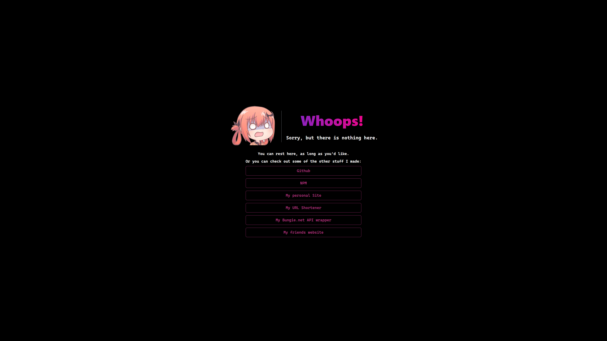
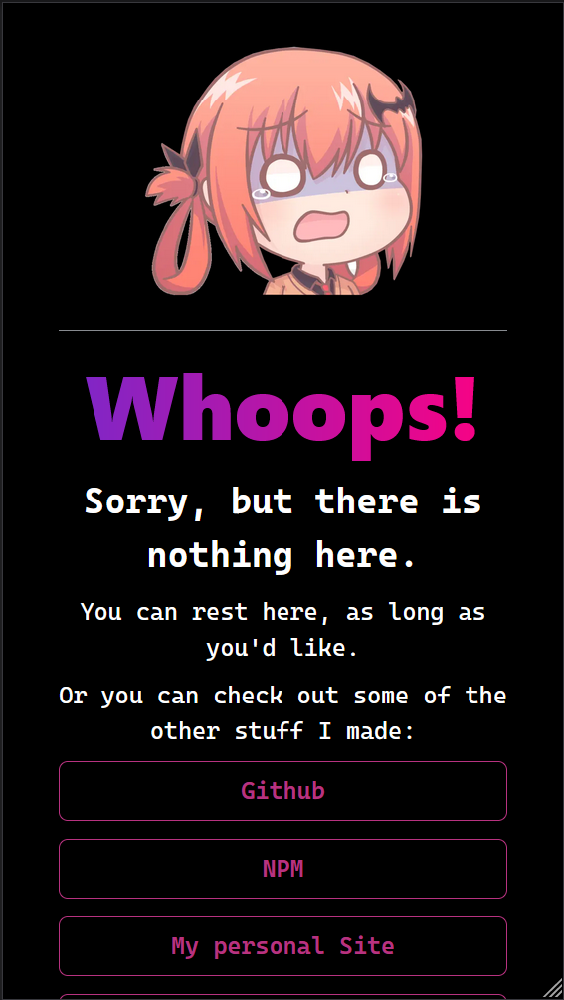

# Miko.sh
Miko.sh is just a simple catch-all 404 Page using Next JS and Chakra-UI. I use it for this page: [miko.sh](https://miko.sh)
## Why?
I wanted something on my root domain, while I work on stuff for it... so I whipped up this real quick.
## Screenshots
### Desktop

### Mobile
